<!-- Generado por scripts/generar.mjs. Edita scripts/datos.mjs y corre `npm run generar`. -->

<a href="https://benjamin-pena.vercel.app/es">
<picture>
  <source media="(prefers-color-scheme: dark)" srcset="assets/encabezado-es-dark.svg">
  
</picture>
</a>

Estoy terminando Ingeniería Civil en Informática en la Universidad Andrés Bello (egreso en noviembre de 2026). Construyo interfaces rápidas, accesibles y agradables de usar, y últimamente casi todas son sobre Chile: su cielo, sus sismos y su economía.

Antes pasé un año y medio en CMPC, primero como analista de datos haciendo reportes en Power BI y después diseñando y poniendo en marcha el portal interno del área de ciberseguridad TI/OT. Ahora estoy con mi tesis sobre metaheurísticas para optimización combinatoria y tomo proyectos freelance de frontend.

Estoy disponible para trabajo full-time y freelance.

**[Portafolio](https://benjamin-pena.vercel.app/es)** &nbsp;&nbsp; [LinkedIn](https://www.linkedin.com/in/benjam%C3%ADn-pe%C3%B1a) &nbsp;&nbsp; [CV (PDF)](https://benjamin-pena.vercel.app/CV-Benjamin-Pena.pdf) &nbsp;&nbsp; [benja.diaz.2911@gmail.com](mailto:benja.diaz.2911@gmail.com) &nbsp;&nbsp; [Read in English](README.md)

## Proyectos

<a href="https://benjamin-pena.vercel.app/es">
<picture>
  <source media="(prefers-color-scheme: dark)" srcset="assets/proyecto-portafolio-es-dark.svg">
  
</picture>
</a>

Mi sitio personal, en español e inglés, con tema claro y oscuro. Cero violaciones de axe-core y Lighthouse 100 en escritorio.

`Next.js 15` `TypeScript` `GSAP` `Lenis` `Tailwind CSS` 
[Ver sitio](https://benjamin-pena.vercel.app/es) &nbsp;&nbsp; [Código](https://github.com/Bentonio96/Landing-Page)

<a href="https://atacama-puce.vercel.app">
<picture>
  <source media="(prefers-color-scheme: dark)" srcset="assets/proyecto-atacama-dark.svg">
  
</picture>
</a>

Ensayo visual sobre el cielo de Atacama y la astronomía en Chile, contado con scroll en siete capítulos y dos idiomas. Accesible de punta a punta, con una versión real para movimiento reducido y no solo las animaciones apagadas.

`React 19` `TypeScript` `GSAP ScrollTrigger` `D3` `Tailwind CSS` 
[Ver sitio](https://atacama-puce.vercel.app) &nbsp;&nbsp; [Código](https://github.com/Bentonio96/Atacama)

<a href="https://epicentro-sigma.vercel.app">
<picture>
  <source media="(prefers-color-scheme: dark)" srcset="assets/proyecto-epicentro-dark.svg">
  
</picture>
</a>

Rastreador de sismos en Chile en tiempo real con datos del USGS. Un mapa en vivo sincronizado con un listado que funciona entero con teclado y lector de pantalla.

`Next.js 15` `TypeScript` `MapLibre` `Recharts` `Tailwind CSS` 
[Ver sitio](https://epicentro-sigma.vercel.app) &nbsp;&nbsp; [Código](https://github.com/Bentonio96/Epicentro)

<a href="https://barometro-hazel.vercel.app">
<picture>
  <source media="(prefers-color-scheme: dark)" srcset="assets/proyecto-barometro-dark.svg">
  
</picture>
</a>

Indicadores económicos de Chile, pensado para lo que la mayoría de los dashboards resuelve mal: series que se publican con distinta frecuencia. Valores del día, histórico, comparación en base 100 y conversor CLP/UF/UTM/USD/EUR, desde mindicador.cl.

`Next.js 15` `TypeScript` `Recharts` `Tailwind CSS` 
[Ver sitio](https://barometro-hazel.vercel.app) &nbsp;&nbsp; [Código](https://github.com/Bentonio96/Barometro)

<a href="https://centinela-rho.vercel.app">
<picture>
  <source media="(prefers-color-scheme: dark)" srcset="assets/proyecto-centinela-dark.svg">
  
</picture>
</a>

Dashboard de monitoreo de incidentes de ciberseguridad. Una sola pantalla donde el analista ve qué hay abierto, qué es crítico y qué conviene mirar ahora.

`React 19` `TypeScript` `Recharts` `Vite` `Tailwind CSS` 
[Ver sitio](https://centinela-rho.vercel.app) &nbsp;&nbsp; [Código](https://github.com/Bentonio96/Centinela)

<a href="https://turnera-iota.vercel.app">
<picture>
  <source media="(prefers-color-scheme: dark)" srcset="assets/proyecto-turnera-dark.svg">
  
</picture>
</a>

Sitio de producto para una app ficticia de gestión de turnos en clínicas pequeñas. El producto no existe; el rigor visual y el presupuesto de rendimiento sí (Lighthouse 99/100/100/100).

`React 19` `TypeScript` `Framer Motion` `Vite` `Tailwind CSS` 
[Ver sitio](https://turnera-iota.vercel.app) &nbsp;&nbsp; [Código](https://github.com/Bentonio96/Turnera)

## Stack

| | |
|---|---|
| Frontend | `React` `TypeScript` `JavaScript` `Next.js` `Tailwind CSS` `GSAP` `Framer Motion` `D3` |
| Datos y back | `Power BI` `Power Query` `Python` `SQL Server` `Oracle` `.NET` |
| Herramientas | `Figma` `Power Pages` `Power Apps` `Git` `Vercel` `Vite` |
| Incorporando | `shadcn/ui` `Zustand` `Storybook` `Vitest` |
