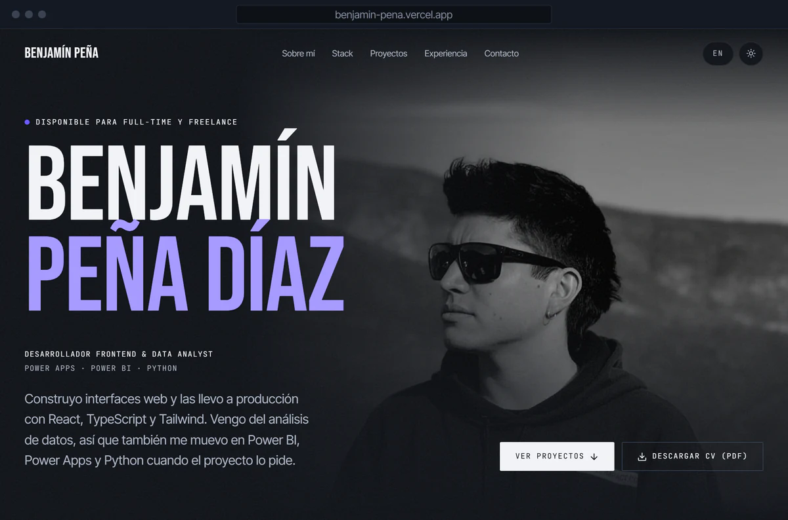
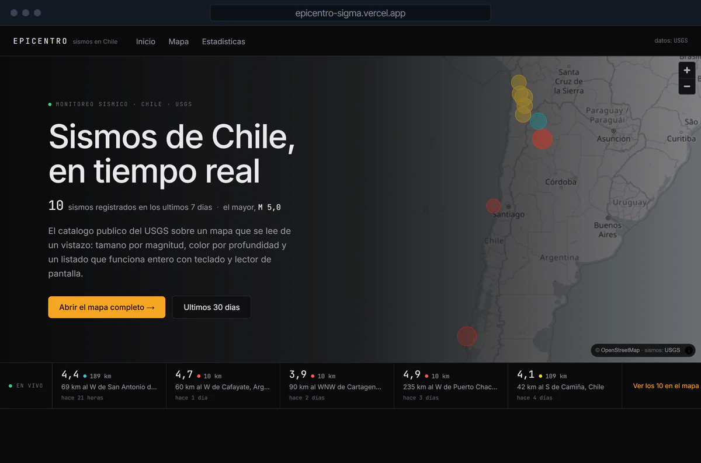
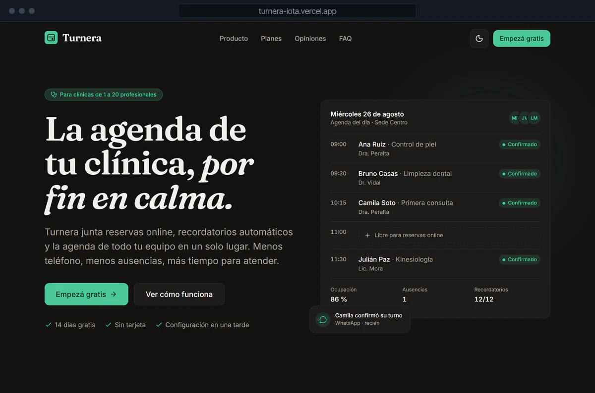
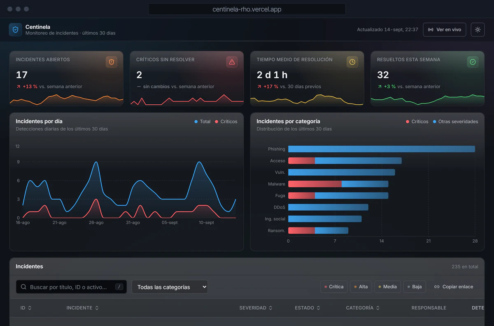
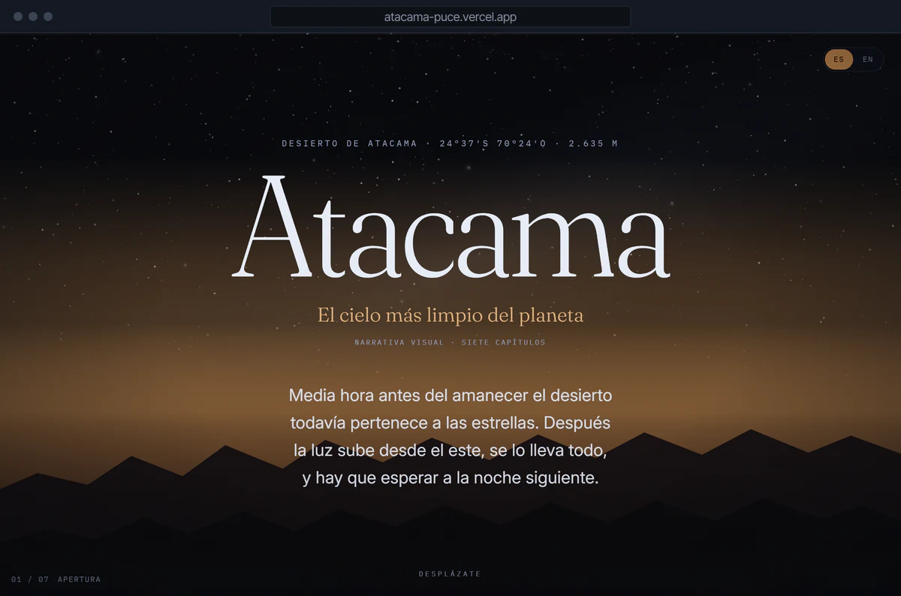
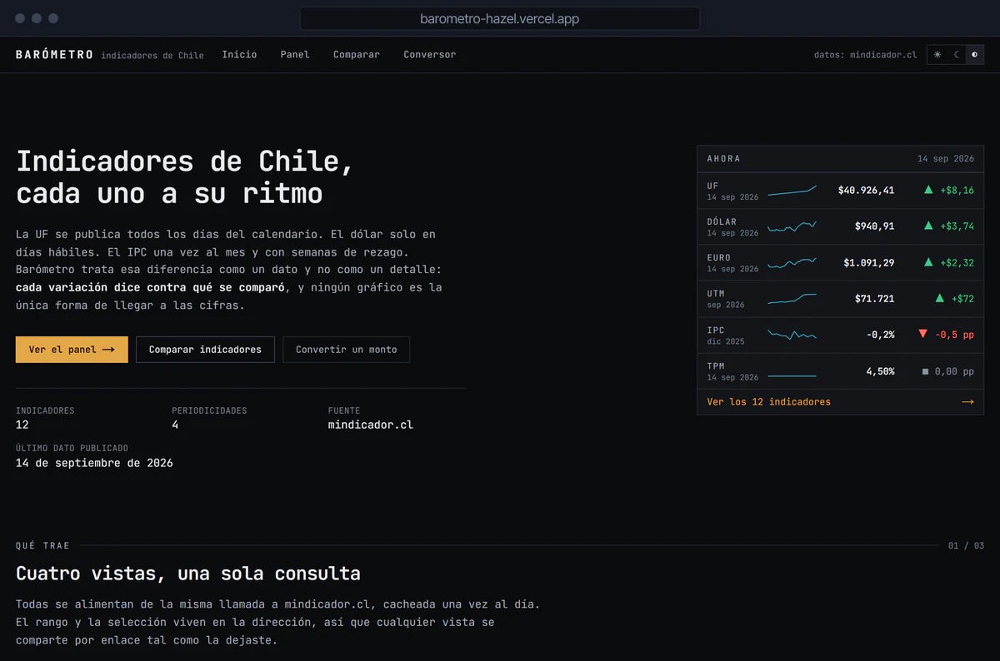

<!-- Generado por scripts/generar.mjs. Edita scripts/datos.mjs y corre `npm run generar`. -->

<a href="https://benjamin-pena.vercel.app/es">
<picture>
  <source media="(prefers-color-scheme: dark)" srcset="assets/encabezado-es-dark.svg">
  
</picture>
</a>

Estoy terminando Ingeniería Civil en Informática en la Universidad Andrés Bello (egreso en noviembre de 2026). Construyo interfaces rápidas, accesibles y agradables de usar, y últimamente casi todas son sobre Chile: su cielo, sus sismos y su economía.

Antes pasé un año y medio en CMPC, primero como analista de datos haciendo reportes en Power BI y después diseñando y poniendo en marcha el portal interno del área de ciberseguridad TI/OT. Ahora estoy con mi tesis sobre metaheurísticas para optimización combinatoria y tomo proyectos freelance de frontend.

Estoy disponible para trabajo full-time y freelance.

**[Portafolio](https://benjamin-pena.vercel.app/es)** &nbsp;&nbsp; [LinkedIn](https://www.linkedin.com/in/benjam%C3%ADn-pe%C3%B1a) &nbsp;&nbsp; [CV (PDF)](https://benjamin-pena.vercel.app/CV-Benjamin-Pena.pdf) &nbsp;&nbsp; [benja.diaz.2911@gmail.com](mailto:benja.diaz.2911@gmail.com) &nbsp;&nbsp; [Read in English](README.md)

## Proyectos

<table>
<tr>
<td width="50%" valign="top">

<h3><a href="https://benjamin-pena.vercel.app/es">Portafolio</a></h3>

Mi sitio personal, en dos idiomas y dos temas. Lighthouse 100 y cero violaciones de axe-core.

<code>Next.js 15</code> <code>TypeScript</code> <code>GSAP</code> <code>Lenis</code> <code>Tailwind CSS</code>

<a href="https://benjamin-pena.vercel.app/es">Ver sitio</a> &nbsp; <a href="https://github.com/Bentonio96/Landing-Page">Código</a>

</td>
<td width="50%" valign="top">

<h3><a href="https://epicentro-sigma.vercel.app">Epicentro</a></h3>

Sismos de Chile en tiempo real con datos del USGS, con un mapa sincronizado a un listado accesible con teclado.

<code>Next.js 15</code> <code>TypeScript</code> <code>MapLibre</code> <code>Recharts</code> <code>Tailwind CSS</code>

<a href="https://epicentro-sigma.vercel.app">Ver sitio</a> &nbsp; <a href="https://github.com/Bentonio96/Epicentro">Código</a>

</td>
</tr>
<tr>
<td width="50%" valign="top">

<h3><a href="https://turnera-iota.vercel.app">Turnera</a></h3>

Sitio de producto para una app ficticia de turnos para clínicas, con demo de reserva funcional. Lighthouse 99/100/100/100.

<code>React 19</code> <code>TypeScript</code> <code>Framer Motion</code> <code>Vite</code> <code>Tailwind CSS</code>

<a href="https://turnera-iota.vercel.app">Ver sitio</a> &nbsp; <a href="https://github.com/Bentonio96/Turnera">Código</a>

</td>
<td width="50%" valign="top">

<h3><a href="https://centinela-rho.vercel.app">Centinela</a></h3>

Dashboard de incidentes de ciberseguridad: qué está abierto, qué es crítico y qué mirar ahora, en una pantalla.

<code>React 19</code> <code>TypeScript</code> <code>Recharts</code> <code>Vite</code> <code>Tailwind CSS</code>

<a href="https://centinela-rho.vercel.app">Ver sitio</a> &nbsp; <a href="https://github.com/Bentonio96/Centinela">Código</a>

</td>
</tr>
<tr>
<td width="50%" valign="top">

<h3><a href="https://atacama-puce.vercel.app">Atacama</a></h3>

Ensayo visual sobre el cielo de Atacama, contado con scroll en siete capítulos y con versión real para movimiento reducido.

<code>React 19</code> <code>TypeScript</code> <code>GSAP ScrollTrigger</code> <code>D3</code> <code>Tailwind CSS</code>

<a href="https://atacama-puce.vercel.app">Ver sitio</a> &nbsp; <a href="https://github.com/Bentonio96/Atacama">Código</a>

</td>
<td width="50%" valign="top">

<h3><a href="https://barometro-hazel.vercel.app">Barómetro</a></h3>

Indicadores económicos de Chile que respetan la frecuencia de cada serie, con conversor CLP/UF/USD.

<code>Next.js 15</code> <code>TypeScript</code> <code>Recharts</code> <code>Tailwind CSS</code>

<a href="https://barometro-hazel.vercel.app">Ver sitio</a> &nbsp; <a href="https://github.com/Bentonio96/Barometro">Código</a>

</td>
</tr>
</table>

## Stack

| | |
|---|---|
| Frontend | `React` `TypeScript` `JavaScript` `Next.js` `Tailwind CSS` `GSAP` `Framer Motion` `D3` |
| Datos y back | `Power BI` `Power Query` `Python` `SQL Server` `Oracle` `.NET` |
| Herramientas | `Figma` `Power Pages` `Power Apps` `Git` `Vercel` `Vite` |
| Incorporando | `shadcn/ui` `Zustand` `Storybook` `Vitest` |
