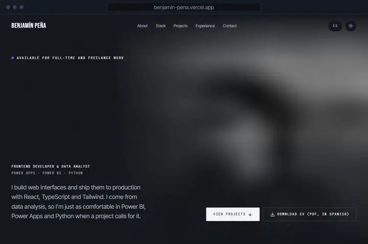
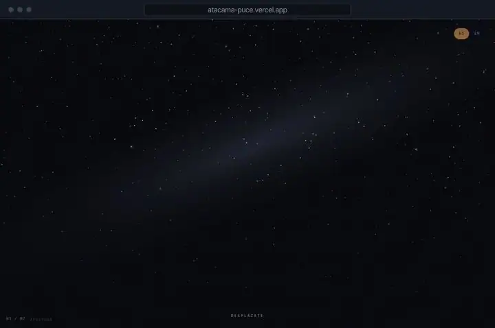
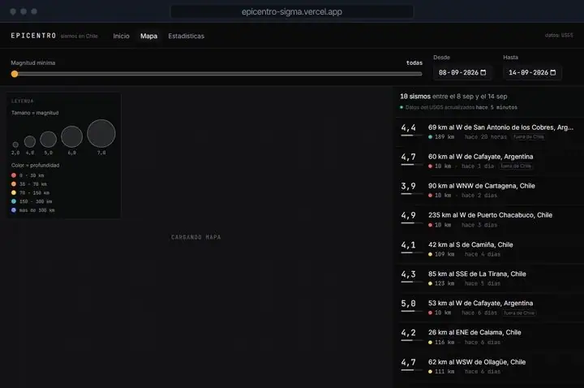
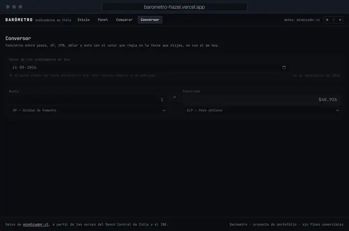
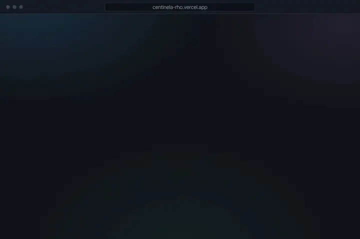
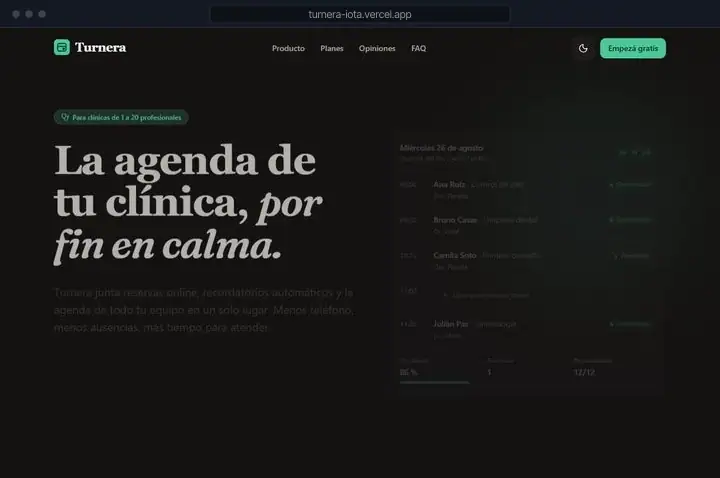

<!-- Generado por scripts/generar.mjs. Edita scripts/datos.mjs y corre `npm run generar`. -->

<a href="https://benjamin-pena.vercel.app/en">
<picture>
  <source media="(prefers-color-scheme: dark)" srcset="assets/encabezado-en-dark.svg">
  
</picture>
</a>

I'm finishing Computer Engineering at Universidad Andrés Bello (graduating November 2026). I build interfaces that are fast, accessible and pleasant to use, and lately most of them are about Chile: its sky, its earthquakes and its economy.

Before that I spent a year and a half at CMPC, first building Power BI reports as a data analyst and then designing and launching the internal portal for the IT/OT cybersecurity operations team. Right now I'm writing my thesis on metaheuristics for combinatorial optimization and taking on freelance frontend work.

I'm open to full-time and freelance roles.

**[Portfolio](https://benjamin-pena.vercel.app/en)** &nbsp;&nbsp; [LinkedIn](https://www.linkedin.com/in/benjam%C3%ADn-pe%C3%B1a) &nbsp;&nbsp; [CV (PDF)](https://benjamin-pena.vercel.app/CV-Benjamin-Pena.pdf) &nbsp;&nbsp; [benja.diaz.2911@gmail.com](mailto:benja.diaz.2911@gmail.com) &nbsp;&nbsp; [Leer en español](README.es.md)

## Projects

<table>
<tr>
<td width="50%" valign="top">

<h3><a href="https://benjamin-pena.vercel.app/en">Portfolio</a></h3>

My personal site, in two languages and two themes. Lighthouse 100 and zero axe-core violations.

<code>Next.js 15</code> <code>TypeScript</code> <code>GSAP</code> <code>Lenis</code> <code>Tailwind CSS</code>

<a href="https://benjamin-pena.vercel.app/en">Live site</a> &nbsp; <a href="https://github.com/Bentonio96/Landing-Page">Source code</a>

</td>
<td width="50%" valign="top">

<h3><a href="https://atacama-puce.vercel.app">Atacama</a></h3>

A scroll-driven visual essay about the Atacama sky, in seven chapters, with a real reduced-motion version.

<code>React 19</code> <code>TypeScript</code> <code>GSAP ScrollTrigger</code> <code>D3</code> <code>Tailwind CSS</code>

<a href="https://atacama-puce.vercel.app">Live site</a> &nbsp; <a href="https://github.com/Bentonio96/Atacama">Source code</a>

</td>
</tr>
<tr>
<td width="50%" valign="top">

<h3><a href="https://epicentro-sigma.vercel.app">Epicentro</a></h3>

Real-time earthquakes in Chile from USGS data, with a map synced to a fully keyboard-accessible listing.

<code>Next.js 15</code> <code>TypeScript</code> <code>MapLibre</code> <code>Recharts</code> <code>Tailwind CSS</code>

<a href="https://epicentro-sigma.vercel.app">Live site</a> &nbsp; <a href="https://github.com/Bentonio96/Epicentro">Source code</a>

</td>
<td width="50%" valign="top">

<h3><a href="https://barometro-hazel.vercel.app">Barómetro</a></h3>

Chilean economic indicators that handle series published at different frequencies, plus a CLP/UF/USD converter.

<code>Next.js 15</code> <code>TypeScript</code> <code>Recharts</code> <code>Tailwind CSS</code>

<a href="https://barometro-hazel.vercel.app">Live site</a> &nbsp; <a href="https://github.com/Bentonio96/Barometro">Source code</a>

</td>
</tr>
<tr>
<td width="50%" valign="top">

<h3><a href="https://centinela-rho.vercel.app">Centinela</a></h3>

Security incident dashboard: what is open, what is critical and what to look at next, on one screen.

<code>React 19</code> <code>TypeScript</code> <code>Recharts</code> <code>Vite</code> <code>Tailwind CSS</code>

<a href="https://centinela-rho.vercel.app">Live site</a> &nbsp; <a href="https://github.com/Bentonio96/Centinela">Source code</a>

</td>
<td width="50%" valign="top">

<h3><a href="https://turnera-iota.vercel.app">Turnera</a></h3>

Product site for a fictional scheduling app for small clinics, with a working booking demo. Lighthouse 99/100/100/100.

<code>React 19</code> <code>TypeScript</code> <code>Framer Motion</code> <code>Vite</code> <code>Tailwind CSS</code>

<a href="https://turnera-iota.vercel.app">Live site</a> &nbsp; <a href="https://github.com/Bentonio96/Turnera">Source code</a>

</td>
</tr>
</table>

## Stack

| | |
|---|---|
| Frontend | `React` `TypeScript` `JavaScript` `Next.js` `Tailwind CSS` `GSAP` `Framer Motion` `D3` |
| Data and back end | `Power BI` `Power Query` `Python` `SQL Server` `Oracle` `.NET` |
| Tools | `Figma` `Power Pages` `Power Apps` `Git` `Vercel` `Vite` |
| Currently learning | `shadcn/ui` `Zustand` `Storybook` `Vitest` |
