<!-- Generado por scripts/generar.mjs. Edita scripts/datos.mjs y corre `npm run generar`. -->

<a href="https://benjamin-pena.vercel.app/en">
<picture>
  <source media="(prefers-color-scheme: dark)" srcset="assets/encabezado-en-dark.svg">
  
</picture>
</a>

I'm finishing Computer Engineering at Universidad Andrés Bello (graduating November 2026). I build interfaces that are fast, accessible and pleasant to use, and lately most of them are about Chile: its sky, its earthquakes and its economy.

Before that I spent a year and a half at CMPC, first building Power BI reports as a data analyst and then designing and launching the internal portal for the IT/OT cybersecurity operations team. Right now I'm writing my thesis on metaheuristics for combinatorial optimization and taking on freelance frontend work.

I'm open to full-time and freelance roles.

**[Portfolio](https://benjamin-pena.vercel.app/en)** &nbsp;&nbsp; [LinkedIn](https://www.linkedin.com/in/benjam%C3%ADn-pe%C3%B1a) &nbsp;&nbsp; [CV (PDF)](https://benjamin-pena.vercel.app/CV-Benjamin-Pena.pdf) &nbsp;&nbsp; [benja.diaz.2911@gmail.com](mailto:benja.diaz.2911@gmail.com) &nbsp;&nbsp; [Leer en español](README.es.md)

## Projects

<a href="https://atacama-puce.vercel.app">
<picture>
  <source media="(prefers-color-scheme: dark)" srcset="assets/proyecto-atacama-dark.svg">
  
</picture>
</a>

A scroll-driven visual essay about the Atacama sky and astronomy in Chile, in seven chapters and two languages. Accessible end to end, with a real reduced-motion version instead of animations simply switched off.

`React 19` `TypeScript` `GSAP ScrollTrigger` `D3` `Tailwind CSS` 
[Live site](https://atacama-puce.vercel.app) &nbsp;&nbsp; [Source code](https://github.com/Bentonio96/Atacama)

<a href="https://epicentro-sigma.vercel.app">
<picture>
  <source media="(prefers-color-scheme: dark)" srcset="assets/proyecto-epicentro-dark.svg">
  
</picture>
</a>

Real-time earthquake tracker for Chile using USGS data. A live map synced with a listing that works end to end with a keyboard and a screen reader.

`Next.js 15` `TypeScript` `MapLibre` `Recharts` `Tailwind CSS` 
[Live site](https://epicentro-sigma.vercel.app) &nbsp;&nbsp; [Source code](https://github.com/Bentonio96/Epicentro)

<a href="https://barometro-hazel.vercel.app">
<picture>
  <source media="(prefers-color-scheme: dark)" srcset="assets/proyecto-barometro-dark.svg">
  
</picture>
</a>

Chilean economic indicators, built around what most dashboards get wrong: series published at different frequencies. Daily values, history, base-100 comparison and a CLP/UF/UTM/USD/EUR converter, from mindicador.cl.

`Next.js 15` `TypeScript` `Recharts` `Tailwind CSS` 
[Live site](https://barometro-hazel.vercel.app) &nbsp;&nbsp; [Source code](https://github.com/Bentonio96/Barometro)

<a href="https://centinela-rho.vercel.app">
<picture>
  <source media="(prefers-color-scheme: dark)" srcset="assets/proyecto-centinela-dark.svg">
  
</picture>
</a>

Security incident monitoring dashboard. A single screen where an analyst sees what's open, what's critical and what to look at next.

`React 19` `TypeScript` `Recharts` `Vite` `Tailwind CSS` 
[Live site](https://centinela-rho.vercel.app) &nbsp;&nbsp; [Source code](https://github.com/Bentonio96/Centinela)

<a href="https://turnera-iota.vercel.app">
<picture>
  <source media="(prefers-color-scheme: dark)" srcset="assets/proyecto-turnera-dark.svg">
  
</picture>
</a>

Product site for a fictional appointment-scheduling app for small clinics. The product isn't real; the visual craft and the performance budget are (Lighthouse 99/100/100/100).

`React 19` `TypeScript` `Framer Motion` `Vite` `Tailwind CSS` 
[Live site](https://turnera-iota.vercel.app) &nbsp;&nbsp; [Source code](https://github.com/Bentonio96/Turnera)

<a href="https://benjamin-pena.vercel.app/en">
<picture>
  <source media="(prefers-color-scheme: dark)" srcset="assets/proyecto-portafolio-en-dark.svg">
  
</picture>
</a>

My personal site, in Spanish and English, with light and dark themes. Zero axe-core violations and Lighthouse 100 on desktop.

`Next.js 15` `TypeScript` `GSAP` `Lenis` `Tailwind CSS` 
[Live site](https://benjamin-pena.vercel.app/en) &nbsp;&nbsp; [Source code](https://github.com/Bentonio96/Landing-Page)

## Stack

| | |
|---|---|
| Frontend | `React` `TypeScript` `JavaScript` `Next.js` `Tailwind CSS` `GSAP` `Framer Motion` `D3` |
| Data and back end | `Power BI` `Power Query` `Python` `SQL Server` `Oracle` `.NET` |
| Tools | `Figma` `Power Pages` `Power Apps` `Git` `Vercel` `Vite` |
| Currently learning | `shadcn/ui` `Zustand` `Storybook` `Vitest` |
